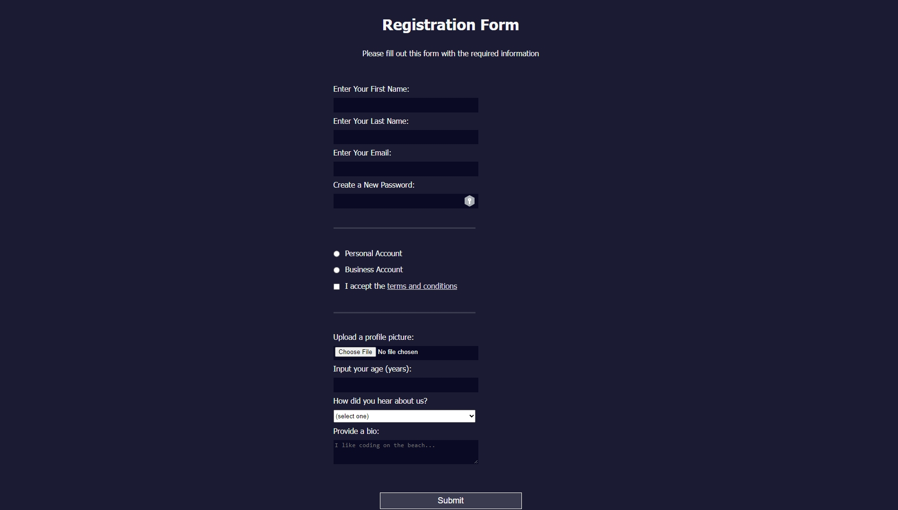

# Registration Form HTML Template

This repository contains a simple and user-friendly HTML template for a registration form. The form is designed to collect essential information from users who want to sign up for a service or platform.

## Features

- Clear headings and labels for each input field provide a user-friendly experience.
- Input validation using the "required" attribute ensures all mandatory fields are filled out.
- Password field pattern that requires lowercase letters and digits (minimum 8 characters).
- Radio buttons and checkboxes for account type selection and accepting terms and conditions.
- Number input field with a minimum and maximum range for the user's age.
- Dropdown menu for users to select how they heard about the service.
- Textarea for users to provide a brief bio about themselves.
- Submit button for easy form submission.

## Usage

1. Clone or download this repository.
2. Open `index.html` in your web browser or integrate the form into your web project.
3. Customize the form's appearance and behavior as needed.

## Contributing

Contributions and feedback are welcome! If you have any suggestions for improvements or bug fixes, please feel free to submit pull requests or open issues.

## License

This project is licensed under the MIT License. See the [LICENSE](LICENSE) file for details.

**Note:** While this template adheres to best practices for a user-friendly registration form, consider adding server-side validation and security measures for production use.

